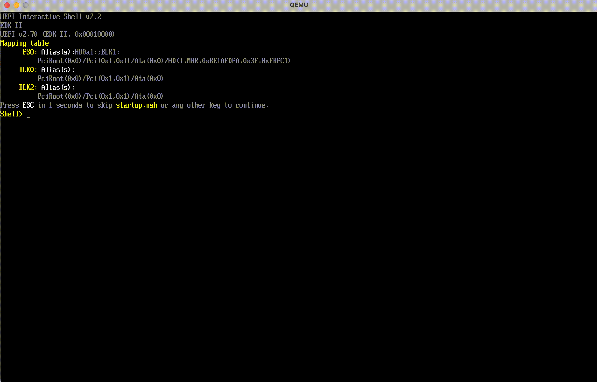

<h1 align="center">bootnim</h1>

## About

*bootnim* is a development environment for writing UEFI drivers/applications in Nim. It features a tiny libc written in Nim to support some of the Nim standard library within the UEFI runtime environment. It also features a Nim-based library that supports UEFI functionality.

## Build Requirements

* Latest Nim compiler
* Latest Zig compiler
  * Any C compiler can be substituted

## Hello World

1. Install the build requirements
2. Clone this repository
```shell
$ git clone https://github.com/earowley/bootnim && cd bootnim
```
3. (Optional) If using QEMU, move OVMF.fd under images/
4. Modify the main function under src/main.nim
```nim
# Must be exported by default
# You can modify the "Nim entry point" in stubs/app.nim
proc main* =
    echo "Hello world"
```
5. Run desired make target
```bash
# Creates .efi binary under build/bin
$ make
# Creates .efi binary and launches QEMU
$ make qemu
```


